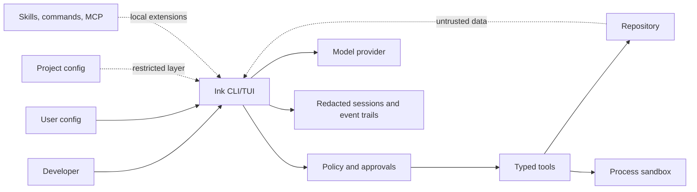

# Threat Model

Ink is a local-first agent. It runs on the developer's machine,
inside a repository, with local config, local session state, local event trails,
and user-configured model providers.

The short version: Ink trusts the operator and the local machine. It does not
trust model output, repository content, tool output, web content, retrieved
memory, or unreviewed extension metadata.

## Assets

| Asset | Security requirement |
| --- | --- |
| Source tree | Do not write outside the intended workspace without explicit policy and approval |
| Credentials | Never store in project config, logs, prompts, traces, snapshots, or Git |
| User config | May configure providers, tools, MCP, formatters, and agents |
| Project config | May describe the project, but cannot silently loosen local security |
| Session history | Redacted, local, replayable, and deletable |
| Event trail | Attributable sequence of model, tool, approval, policy, usage, and outcome events |
| Budget caps | Enforced with exact integer money and fail-closed pricing |
| Release artifacts | Checksummed binaries built from a tagged commit |

## Actors

| Actor | Trust posture |
| --- | --- |
| Developer/operator | Trusted to approve actions and install extensions |
| Model | Untrusted for authority, semi-trusted for useful text |
| Provider | External boundary, only as trusted as the user's chosen provider |
| Repository content | Untrusted data |
| Tool output | Untrusted data |
| Skill, command, MCP server | Local extension content, trusted only because the user put it on disk or in their own config |
| Local machine | Trusted base. A compromised OS, shell, terminal, keychain, or editor is out of scope |

## Boundaries



## Threats And Controls

| Threat | Control | Status |
| --- | --- | --- |
| Prompt injection from repo files, tool output, webpages, or memory | All such content is treated as data. Side effects require typed tool calls, policy checks, and approvals | Implemented |
| Secret literal in config | Config validation scans every merged value and rejects secret-shaped content | Implemented |
| Secret in logs or event trails | Redacting sinks scrub events before persistence. Redaction failure drops the raw event | Implemented |
| Project config loosens security | Project layer is restricted and untrusted keys are rejected unless explicitly trusted where allowed | Implemented |
| Model calls an unexpected tool | Tool registry is explicit. Unknown tools fail, risky tools require policy and approval | Implemented |
| Command execution surprises the user | `run_command` is policy-gated, previewed, attributable, and approval-backed | Implemented |
| Cost overruns | Route `max_cost_usd` fails closed when pricing is unknown. Default session/task budgets warn and continue without a price | Implemented with known display limitations |
| Provider spoofing or instability | Providers are configured by route and health-checked where supported. Unverified providers are not claimed as stable support | Partial |
| Local skill or MCP abuse | Skills are local files, visible in `/skills`, and never execute on their own. MCP tools require approval unless allow-listed | Partial |
| Sandbox escape | Process sandbox reduces blast radius but is not a hard isolation boundary | Accepted risk |
| Compromised local machine | Out of scope | Accepted risk |
| Supply-chain compromise | Direct dependencies are constrained by arch tests, CI runs vulnerability and secret scans, GitHub Actions are pinned | Implemented |
| Bad release artifact | Release workflow builds from tags and publishes checksums | Implemented |

## User Rules

- Install skills, commands, and MCP servers only from sources you trust.
- Read approval prompts. `--yes` and always-approve auto-approve remaining
  policy asks for the session. `auto` auto-approves local writes and
  allow-listed commands and still asks for destructive work.
- Do not paste secrets into prompts or project config.
- Use worktree sessions for risky changes.
- Keep provider credentials in env, keychain, or Ink's secret store.

## Known Gaps

- The process sandbox is not VM-grade isolation and does not isolate the OS network. It scrubs proxy env, confines paths, and enforces timeouts.
- Container-backed sandboxing (`sandbox.provider = "container"`, Docker or Podman, `--network none`) is implemented and optional; process remains the default.
- Some provider and OAuth flows are implemented but not live-verified by the
  owner.
- There is no hosted extension marketplace or remote trust service.
- Release package-manager formulas are planned after the first stable binary
  release.

## Checks

Local release and contribution gates:

```console
scripts/check.sh --strict
```

CI repeats format, vet, static analysis, race tests, vulnerability scanning,
link checking, and secret scanning. The release workflow builds checksummed
archives for macOS, Linux, and Windows.
